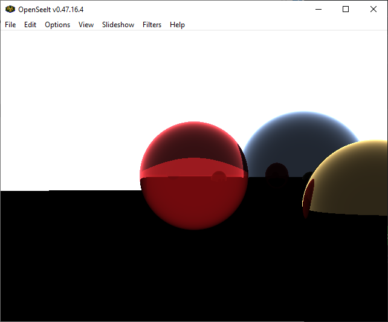

# Ray-Tracer Optimizations

&nbsp;

&nbsp;

A ray-tracing algorithm that incorporates several memory management features and utilizes various low-level optimization techniques to greatly improve performance and efficiency.

## List of Features

- [x] Memory Management
- [x] Memory Pools
- [x] Multi-Threading
- [x] Ray-Tracing
- [x] Linux Port
- [x] JSON File Loading

## Getting Started

The advanced graphics framework provides numerous tools for interacting with the graphics features that have been implemented. Refer to the following information on how to install and use the application.

### Dependencies
To use the framework, the following prerequisites must be met.
* Windows 10+
* Visual Studio
* Git Version Control

The framework only requires the following external files to function.
* nlohmann json

### Installing

To download a copy of the framework, select "Download ZIP" from the main code repository page, or create a fork of the project. More information on forking a GitHub respository can be found [here](https://www.youtube.com/watch?v=XTolZqmZq6s).

### Executing program

As the project only requires the use of the nlohmann json header and no other additional libraries or APIS, there are no additional steps required to execute the application on windows.

Please refer to the _ubuntu-info.txt_ file in the _Resources_ folder on the steps needed to run the application on the Ubuntu distro on the Linux platform.

Please refer to the _ffmpeg-info.txt_ file in the _Resources_ folder on the steps needed to view the generated files from the ray tracer.

## Appendices

https://user-images.githubusercontent.com/39779606/223144464-7d74675f-af60-4316-bfc6-60571e857d32.mp4

https://user-images.githubusercontent.com/39779606/223144670-b9a21fcb-7b96-4787-85ea-2b7b3c64cbb3.mp4

https://user-images.githubusercontent.com/39779606/223144732-48e049a0-87bf-40ea-a30a-a08cff4dff44.mp4
