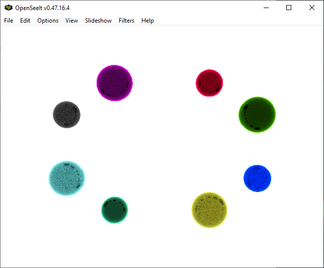
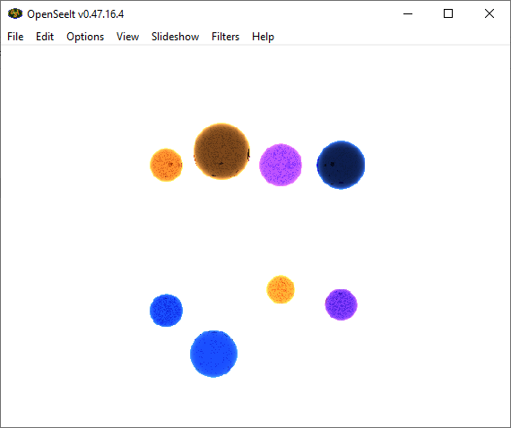
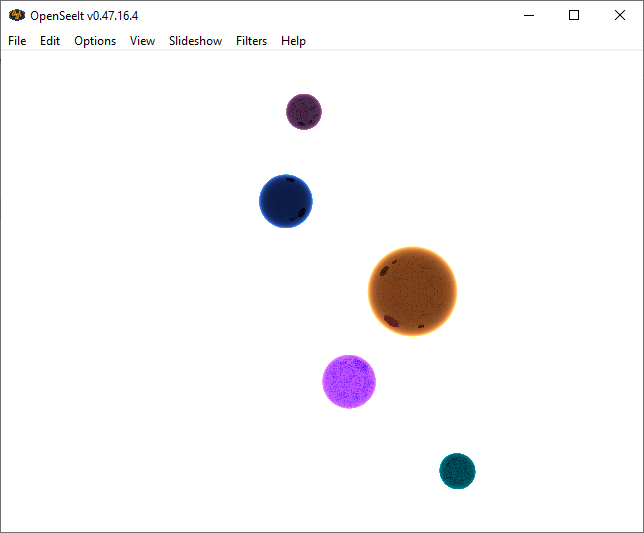

# Ray-Tracer Optimizations

A ray-tracing algorithm that incoporates several memory management features and utilizes various low-level optimization techniques to greatly improve performance and efficiency. 

 &nbsp;

 &nbsp;

## List of Features

- [x] Memory Management
- [x] Memory Pools
- [x] Multi-Threading
- [x] Ray-Tracing
- [x] Linux Port
- [x] JSON File Loading
